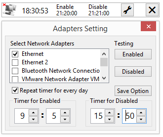

Network Adapters Switch for free Lazarus

网卡适配器定时开关 NetSwitch

========================================

  该软件实现定时启用或关闭网卡，适用于win7/8.X/10/11
  
  从硬件资源层控制网卡的网络连接功能。常用于电脑全年72小时不关机，但需要每天定时连接网络，并定时断开网络。
  

## 代码编译环境

### 编译软件

Free Pascal for Lazarus version 3.4 , fpc version 3.2.2

### 编译系统

window 8.x, support win 10/11

---

---

### 注意事项

 默认编译为64位。
 软件使用需 administion 或 highestAvailable 权限。编译时不自动运行，需手动运行。或使用证书签名软件可解决软件权限弹窗提示。
 
 代码仅供学习或参考用途。水平有限，欢迎交流。
